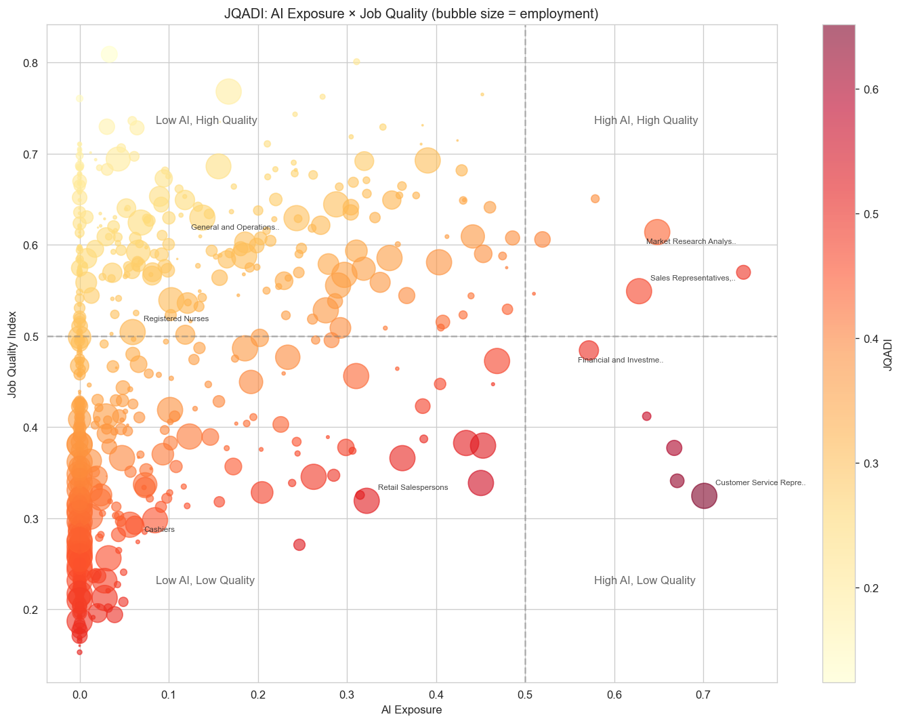
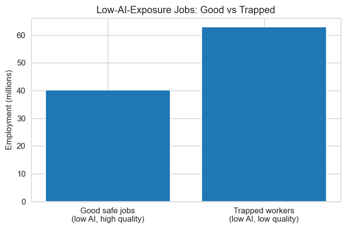
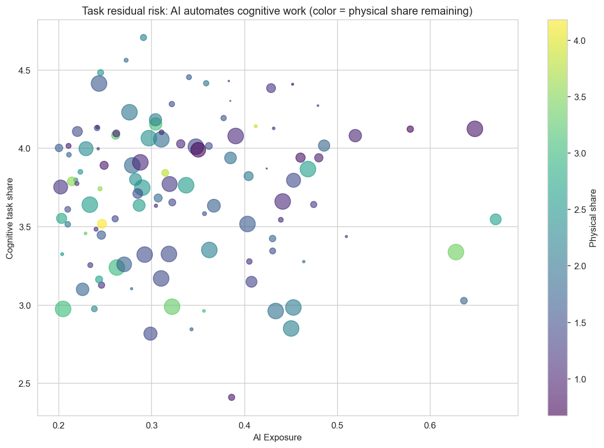
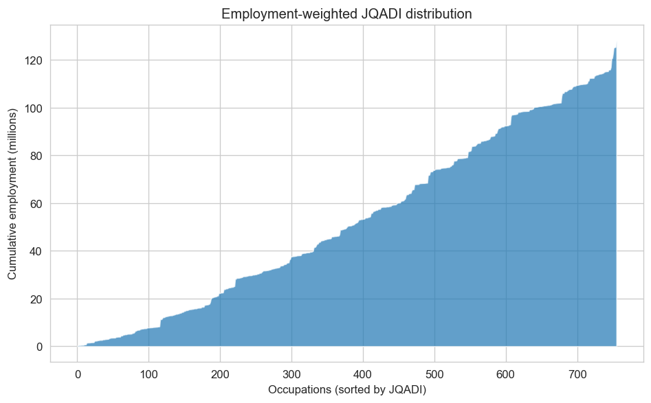

# Job Quality-Adjusted Displacement Index (JQADI)

AI displacement risk focuses on *which* jobs get automated. The harder question is *who* gets left doing the jobs no one wants—the "meat machines" of the coming economy: cooks, roofers, dishwashers, construction laborers. Safe from AI, unsustainable for humans. Low pay, high physical toll, no career trajectory. This repository implements a **Job Quality-Adjusted Displacement Index** that reframes labor market vulnerability to capture both AI exposure and the quality of the jobs that remain.

---

## The Original Index

Anthropic's "Labor market impacts of AI" (Massenkoff & McCrory, 2026) and Eloundou et al.'s GPTs-are-GPTs (2023) measure *observed exposure*—which occupations face AI displacement risk based on task-level LLM capability (Eloundou β) and real-world Claude usage. Their key finding: no systematic increase in unemployment for highly exposed workers, though hiring of young workers (22–25) into exposed occupations may be slowing.

The bottom 30% of workers by their measure have zero observed coverage: cooks, motorcycle mechanics, lifeguards, bartenders, dishwashers, dressing room attendants. The implicit assumption: low exposure means "safe." But these jobs are safe from AI only in the narrow sense that an LLM cannot currently perform their tasks. They are decidedly not safe in almost every other dimension that matters to human welfare:

- **Low pay**: Median wages for many fall below the national median.
- **Physical toll**: High rates of injury, repetitive strain, standing/lifting demands, and environmental hazards.
- **Short occupational lifespans**: You don't see 60-year-old roofers, movers, or construction laborers—the body gives out long before retirement age.
- **Low satisfaction and high burnout**: Healthcare support workers, food service, and cleaning occupations consistently report among the lowest job satisfaction and highest stress.
- **Precarity**: High turnover, low unionization, minimal benefits, schedule unpredictability.

The most AI-exposed workers are older, more educated, and earn 47% more than the least exposed. AI displacement risk is inversely correlated with job quality. The "safe" jobs are, in many cases, the worst jobs.

---

## The JQADI Framework

For each occupation *o*:

```
JQADI_o = f(AI_Exposure_o, Job_Quality_o)
```

We identify **two danger zones**:

1. **High AI exposure** → Traditional displacement risk (the original papers' focus)
2. **Low AI exposure, low quality** → "Trapped" workers: grinding, unsustainable jobs with no upward mobility

And the **most concerning** category:

3. **Moderate AI exposure, low quality** → Partial automation strips cognitive work, leaving physical drudgery—wage compression, deskilling, task intensification without displacement (the **task residual** effect)

---

## Job Quality Index (JQI)

A composite index [0, 1] from six sub-dimensions:

| Dimension | Weight | Data |
|-----------|--------|------|
| Compensation | 20% | Median hourly wage (OEWS) |
| Physical sustainability | 25% | O\*NET body posture, hazards, environmental exposure, protective equipment; Work Activities physical; Abilities dynamic strength |
| Autonomy | 25% | O\*NET Freedom to Make Decisions, Determine Tasks, Decision Frequency, inverse Repetition, inverse Pace by Equipment |
| Career | 20% | O\*NET Job Zone |
| Employment outlook | 5% | BLS projections pct change (when matched) |
| Age sustainability | 5% | CPS Table 11b ratio 55+ / 25–34 (when available) |

**Age ratio** (55+ / 25–34): A low ratio indicates the occupation "burns through" workers before they age—you don't see 60-year-old roofers. CPS Table 11b provides this directly.

---

## JQADI Formula

```
JQADI = 0.25×AI_Exposure + 0.6×(1−JQI) + 0.15×AI_Exposure×(1−JQI)
```

Weights elevate low-quality jobs so trapped workers rank higher. **Trapped index**: For AI < 0.3, rank by 1−JQI.

---

## Key Outputs

### Quadrant Summary

| Quadrant | Occupations | Employment |
|----------|-------------|------------|
| Low AI, Low Quality (trapped) | 476 | 83.5M |
| Low AI, High Quality (good safe) | 269 | 39.0M |
| High AI, Low Quality | 5 | 3.5M |
| High AI, High Quality | 6 | 2.4M |

### Top Good Safe Jobs (low AI, high quality)

| Occupation | JQI | AI exposure | Wage/hr | Age ratio | Employment |
|------------|-----|-------------|---------|-----------|------------|
| Chief Executives | 0.81 | 0.03 | $86 | 4.77 | 200K |
| Lawyers | 0.77 | 0.17 | $62 | 1.45 | 681K |
| Pediatricians | 0.75 | 0.00 | $82 | — | 34K |
| Architectural/Engineering Managers | 0.74 | 0.03 | $73 | 2.03 | 187K |
| Clinical/Counseling Psychologists | 0.73 | 0.06 | $40 | 2.67 | 58K |
| Podiatrists | 0.73 | 0.00 | $70 | 1.00 | 9K |
| Optometrists | 0.71 | 0.00 | $60 | 1.89 | 39K |
| Nurse Anesthetists | 0.70 | 0.00 | $94 | 1.33 | 44K |

### Top Trapped Workers (low AI, low quality)

| Occupation | JQI | AI exposure | Employment |
|-------------|-----|-------------|------------|
| Landscaping and Groundskeeping Workers | 0.19 | 0.00 | 892K |
| Cutting, Punching, Press Machine Setters (Metal/Plastic) | 0.18 | 0.00 | 180K |
| Meat, Poultry, Fish Cutters and Trimmers | 0.19 | 0.00 | 132K |
| Farmworkers and Laborers (Crop, Nursery, Greenhouse) | 0.20 | 0.02 | 277K |
| Cement Masons and Concrete Finishers | 0.18 | 0.00 | 187K |
| Slaughterers and Meat Packers | 0.19 | 0.00 | 86K |
| Molding, Coremaking, Casting Machine Setters | 0.21 | 0.00 | 163K |
| Textile Winding/Twisting Machine Setters | 0.17 | 0.00 | 22K |

### Top JQADI Risk (combined displacement + low quality)

| Occupation | JQADI | AI exposure | JQI | Employment |
|------------|-------|-------------|-----|------------|
| Customer Service Representatives | 0.64 | 0.70 | 0.34 | 2.8M |
| Data Entry Keyers | 0.62 | 0.67 | 0.36 | 147K |
| Medical Records Specialists | 0.60 | 0.67 | 0.38 | 181K |
| Medical Transcriptionists | 0.57 | 0.64 | 0.41 | 56K |
| Office Clerks, General | 0.55 | 0.45 | 0.35 | 2.6M |
| Secretaries and Administrative Assistants | 0.52 | 0.45 | 0.39 | 1.8M |
| Receptionists and Information Clerks | 0.52 | 0.43 | 0.39 | 983K |
| Retail Salespersons | 0.51 | 0.32 | 0.33 | 3.7M |

### Visualizations

**AI Exposure × Job Quality (quadrant map)**



**Good safe vs. trapped (low-AI jobs by employment)**



**Task residual risk** (cognitive share vs. AI exposure; color = physical share remaining)



**Employment-weighted cumulative risk**



### Output Files

| File | Description |
|------|-------------|
| `good_safe_jobs.csv` | 322 occupations: low AI + high JQI |
| `trapped_workers.csv` | 31 occupations: low AI, low quality |
| `task_residual_risk.csv` | Jobs where AI strips cognitive work, leaves physical drudgery |
| `career_viable_safe.csv` | 68 occupations: good safe + wage above median + sustainable age ratio |
| `top_jqadi_occupations.csv` | Top 15 by combined JQADI risk |
| `quadrant_analysis.csv` | Counts and employment by quadrant |

See [output/](output/) for full CSVs.

---

## Quick Start

```bash
python -m venv .venv && source .venv/bin/activate  # or .venv\Scripts\activate on Windows
pip install -r requirements.txt
python scripts/download_data.py
python scripts/build_jqadi.py
python scripts/visualize.py
```

**Data requirements**: O\*NET 30.2, Anthropic job_exposure (or Eloundou β fallback), GPTs repo OEWS/projections, CPS Table 11b (manual download if BLS blocks). See `scripts/download_data.py` for URLs.

---

## Limitations

- **GSS-QWL, SOII, NCS, JOLTS** not integrated (require registration, crosswalks, or different granularity)
- **Observed exposure** is single-platform (Claude); Eloundou β used as fallback
- **Robotics** not modeled; physical labor faces separate automation threat (e.g., Acemoglu & Restrepo)
- **Weighting** is a judgment call; sensitivity analysis recommended

---

## References

- Massenkoff, M. & McCrory, P. (2026). Labor market impacts of AI: A new measure and early evidence. Anthropic.
- Eloundou, T., Manning, S., Mishkin, P., & Rock, D. (2023). GPTs are GPTs: An early look at the labor market impact potential of large language models.
- Handa, K., et al. (2025). Which economic tasks are performed with AI? Evidence from millions of Claude conversations.
- Acemoglu, D. & Restrepo, P. (2020). Robots and Jobs: Evidence from US Labor Markets. JPE.
